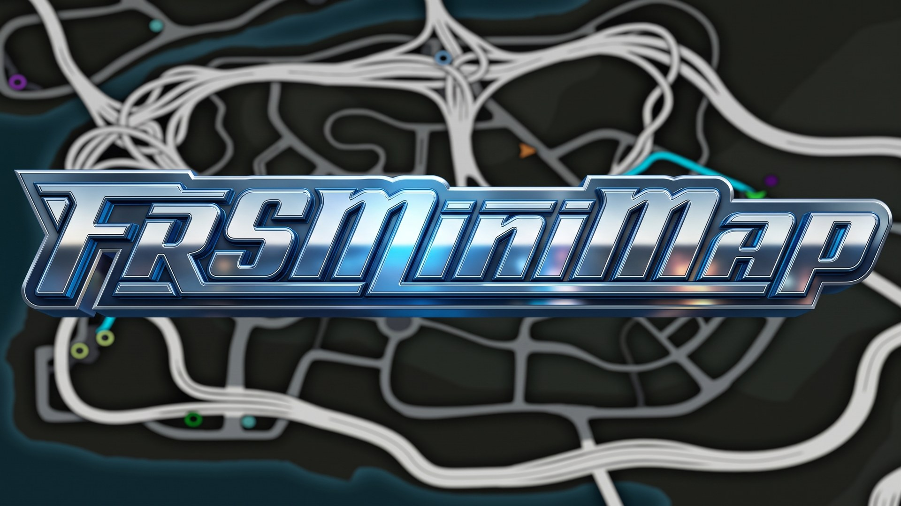

# FRSMiniMap

A 3D minimap for **NFS Underground 2** (`SPEED2.EXE` v1.2 NTSC), built on
[FRSModLoader](https://github.com/chrystianfarias/FRSModLoader). It replaces the game's radar with a tilted map
in perspective that turns with the camera, and reads everything it shows from
the game itself: the map, the races and shops the career has open, the
legend's filters, the GPS route, the other racers.

## What it does

- **The map in perspective**, framed by each track's own calibration
  (`TrackInfo`), for free roam and every race.
- **Turns with the camera**, GTA-style (or with the car), smoothed.
- **Dynamic zoom**: opens up with speed, down to half the base zoom.
- **Race starts and shops** as the pause map shows them right now: only what
  the career has available and discovered, with the legend's filters, and the
  special events (the X) apart - the game is asked entry by entry, with its own
  functions.
- **The nearest of each kind at the edge** when it is out of sight, fading
  with distance.
- **The GPS route** as a line along the streets, read from the game's route
  and cleared behind the car as it goes; with a route set, only the
  destination stays on the map.
- **The other racers** as arrows.
- **Two marker styles**: pins with icons, or the game's own circles and
  colours.
- **Hides the stock minimap**, and nothing else of the HUD; optionally, also
  the blue GPS arrow that floats ahead of the car.
- **An expanded map on M**, in place of the game's: full screen, drag to pan
  with inertia, wheel to zoom towards the cursor, keyboard too; a click on an
  event sets the GPS, a double click puts a marker of your own with its route.

## Requirements

- **[FRSModLoader](https://github.com/chrystianfarias/FRSModLoader) >= 0.1.2** (required).

## Downloads

Each release has two packages:

| Package | |
|---|---|
| `FRSMiniMap-<version>.zip` | the mod, with the **Original** map only (the game's own): its menu has no Theme or Clean map option |
| `FRSMiniMap-<version>-full.zip` | the mod and the map layers (`maps/layers`, ~50 MB). **Needed for the Google Maps, Google Maps Dark and Waze themes, and for Clean map** |

The themes paint the map from those layers; with the light package they fall
back to the Original picture.

## Install

With the game closed:

1. Install **FRSModLoader** (see its README) and start the game once to make
   sure it loads: the Options menu gets a **Mods** entry.
2. Copy this mod into the loader's mods folder, as a folder named
   `frsminimap`:

   ```
   <game>\scripts\FRSModLoader\mods\frsminimap\
     mod.json
     main.js
     thumb.jpg
     ui\
     maps\
   ```

3. Start the game. FRSMiniMap shows up in **Options > Mods**, with its
   picture, its on/off switch and its options.

From a clone of this repository, `install.ps1` does step 2:

```powershell
.\install.ps1                          # F:\Games\NFSU2
.\install.ps1 -GameDir "D:\Games\NFSU2"
```

It only copies files, so it is safe with the game running (F5 on the UI
reloads the page), and it stops with an error if FRSModLoader is not
installed in that game folder. Installing or updating the loader with its
own `install.ps1` replaces the whole `mods` folder: run this one again after
it.

To uninstall, delete `scripts\FRSModLoader\mods\frsminimap\`, or switch the
mod off in Options > Mods.

## In the game

The options are in the game's **Options > Mods > FRSMiniMap**, kept by the
loader between sessions:

| Option | |
|---|---|
| Theme | Original (the game's own map), Google Maps, Google Maps Dark or Waze |
| Clean map | only the roads over the game (in a race, only the track): no ground, water or relief, and no outline on a solid edge |
| 3D buildings | the city's buildings standing on the minimap, each side lit differently (on by default) |
| Shape | Round (default), or Rectangular as GTA V's |
| Edge | Infinite: the map fades out at the edges (default); or Solid, with an outline |
| Size | 50-200 % (default 100). The minimap already follows the screen's resolution; this scales it further |
| Left margin, Bottom margin | the minimap's distance from the screen's edges, 0-400 px at 1080p (default 36) |
| Icons | Pins with icons (default), or Native: the game's circles and colours |
| Turn with | the map turns with the Camera (default) or with the Car |
| Dynamic zoom | the zoom opens up with speed (default), or stays |
| Route in the event's colour | the GPS route takes its destination's marker colour instead of the light blue (off by default) |
| Blue GPS arrow | Hide (default) or Show the HUD's blue GPS arrow |

`/minimap` in the console shows the state (position, track, career, GPS). It
also moves and scales the minimap, saving it as the options above:

| Command | |
|---|---|
| `/minimap pos <x> <y>` | left and bottom margin, in pixels of a 1080p screen |
| `/minimap x <n>`, `/minimap y <n>` | one of the two |
| `/minimap scale <50-200>` | the Size option, in percent |

On the expanded map (M): drag to pan, wheel, Q/E or the + and - buttons to zoom, WASD or the arrows
to move, C or the button under the zoom ones to centre on the car, a click on a pin to set the GPS there, a double click on the map to put a
marker of your own there with the route to it (a double click on the marker
takes it away), Esc or M to close. The filters are the game's own, set on its
pause map.

## Themes

A theme repaints the map in its own colours, and may recolour the markers and
bring its own icons. Themes are JSON files in `ui/themes/`:

```json
{
  "name": "Waze",
  "map": {
    "background": "#252d3a", "land": "#252d3a", "landHigh": "#2e3d52", "reliefStrength": 0.7,
    "water": "#22467a", "alley": "#34485d", "street": "#3e5670", "highway": "#536e89",
    "casing": "#222f40", "casingStrength": 0.6, "shadow": "#070a10", "shadowStrength": 0.92,
    "track": "#3fb6ff", "trackCasing": "#0b1a2b", "start": "#ffffff", "startCasing": "#0b1a2b",
    "fog": "#1b212b"
  },
  "markers": { "player": "#33ccff", "rival": "#ff9f1a", "waypoint": "#ff5c8a", "route": "#3fb6ff",
               "kinds": { "CIRCUIT": "#b388ff", "PAINT": "#ff5252" } },
  "icons": { "RACE": "waze/flag.svg", "PIN": "waze/pin.svg", "PLAYER": "waze/arrow.svg" }
}
```

`"map": null` keeps the game's own map (the Original theme); its `"clean"`
block is the palette the Clean map option paints the roads with. With Clean
map on, every theme skips `land`, `landHigh` and `water`. `icons` is
optional, with paths relative to `ui/themes/`; a kind left out keeps the mod's
icon. The map is painted from the layers in `maps/layers/`, which
`tools/map_layers.py` builds from JeansBig's "NFSU2 Detailed Map" (water,
relief, streets, highways, alleys, the race track and its start lines); a
track without layers shows the game's map.

## 3D buildings

`maps/buildings/<region>.json` holds the buildings the minimap stands up:

```json
{ "buildings": [
  { "p": [x1, y1, x2, y2, ...], "z": 12, "h": 18 },
  { "parts": [ { "p": [...], "z": 12, "h": 40 }, { "p": [...], "z": 52, "h": 25 } ] },
  { "mesh": { "v": [x, y, z, ...], "f": [[0, 1, 2, 3], ...] } }
] }
```

A prism (footprint, base, height), prisms stacked, or a free mesh; world
coordinates. Walls and roofs are made on load; each frame only the buildings
inside the view are drawn, far to near, each face shaded by the light so the
sides differ. The colour is the theme's `building`.

## Layout

```
mod.json, main.js     the in-game side: reads memory, talks to the page
thumb.jpg             the picture in Options > Mods
docs/cover.jpg        the cover at the top of this file
ui/index.html         the page: draws the map, markers, route
ui/icons/             pin, player arrow and the markers' icons
maps/calibration.json framing of the redrawn maps the pack recalibrates
tools/                minimap_calibrate.py (measures calibration.json);
                      minimap_dev.py (dumps the map data to look at while
                      developing)
NOTES.md              what was found in the game, and why the mod does what it does
release.ps1           packs a release zip into release/ (not in git)
```

## Terms of use

By Chrystian Farias. Full terms in [LICENSE](LICENSE).

You may use, modify and redistribute this for free, including your own forks
and derivative mods, as long as you **credit Chrystian Farias** and link back
to <https://github.com/chrystianfarias/FRSMiniMap>. **Selling it is not
allowed**, in whole or in part.

If the mod helps you, you can [buy me a coffee](https://buymeacoffee.com/chrystianfarias).

## Credits

- The themes' map layers (`maps/layers/`) are built from **"NFSU2 Detailed
  Map"** by JeansBig.
- Marker icons (`car`, `flag-checkered`, `house`, `spray-can`, `star`,
  `volume`, `wrench`): **Font Awesome Free** 7, by Fonticons, Inc., under
  [CC BY 4.0](https://fontawesome.com/license/free); the notice is kept in
  each file.
- The pin and the player arrow were drawn for this mod; `xmark.svg` is a
  placeholder.
- The race-start and road-graph formats build on the reverse engineering done
  for FRSWorldEditor.
